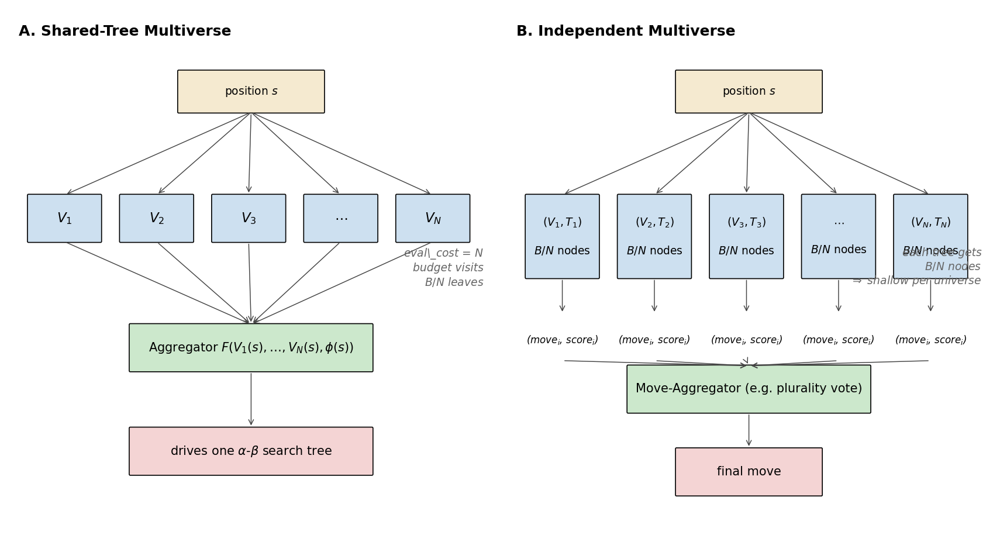
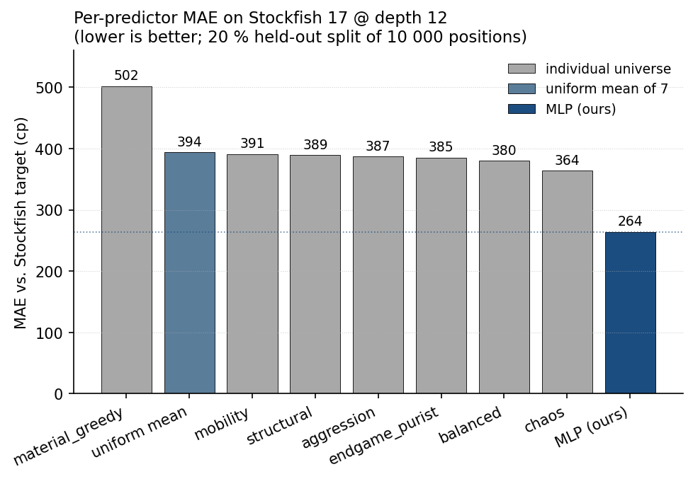
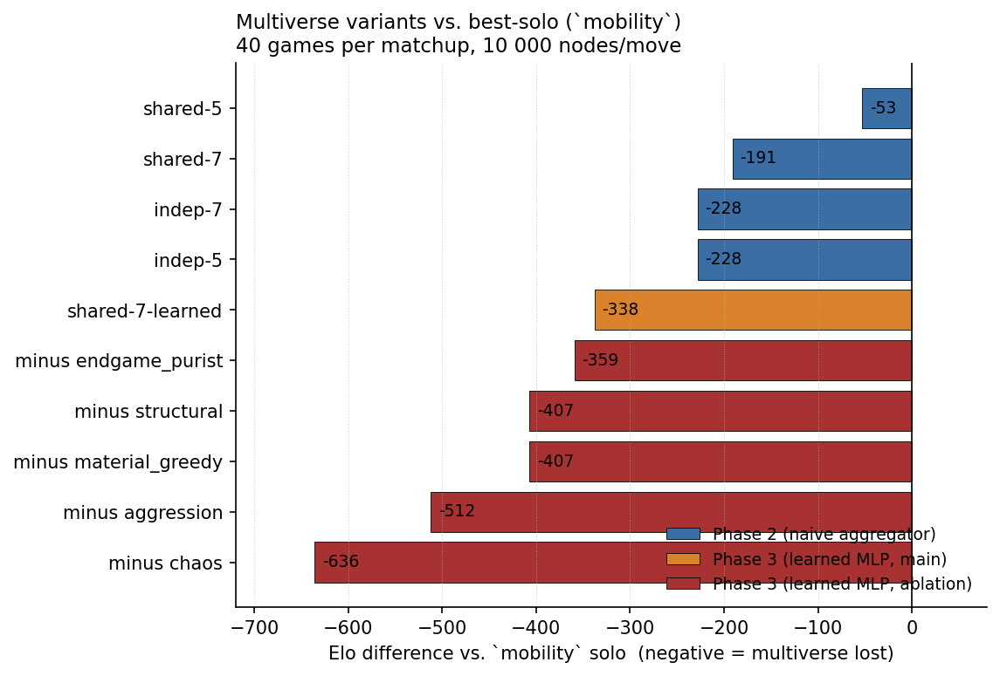
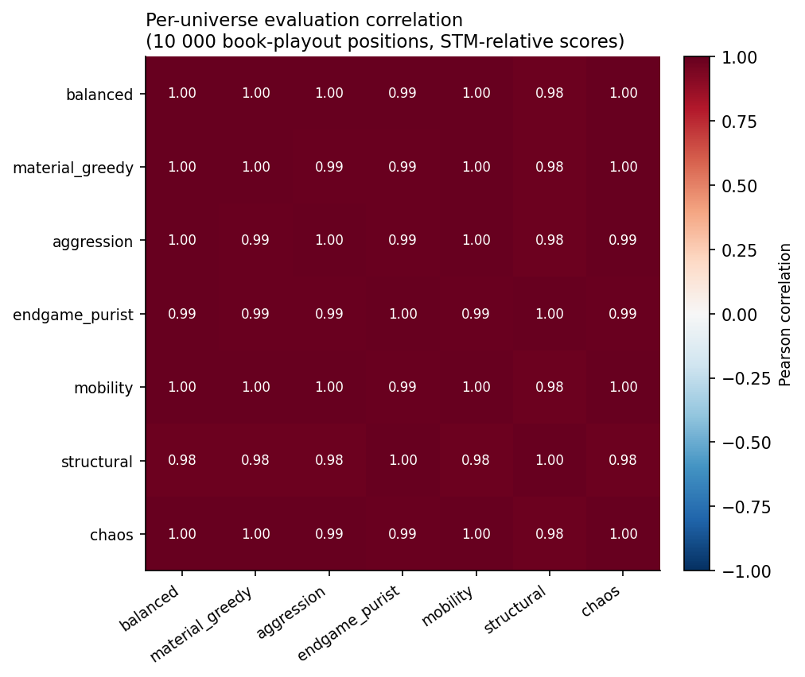

# Multi-Universe Chess Engines: A Negative Result at Equal Compute

**Vanshdeep Singh Kohli**
*Independent · 2026-05-27*
*Code & data: <https://github.com/realANTEC/vi-chess>*

---

## Abstract

We test whether a *multi-universe* chess engine architecture — $N$ parallel evaluators with deliberately different strategic philosophies, aggregated into a single decision per move — beats the strongest single evaluator at **equal total compute**. We construct seven hand-designed universes and two aggregation architectures: a shared alpha-beta tree with $N$ leaf evaluators (`shared-N`), and $N$ independent searches at $B/N$ nodes each, voted at the root (`indep-N`). The study has three phases. Phase 1 runs a round-robin among the seven solo universes to establish a best-solo baseline. Phase 2 plays each of four naive-aggregator multiverse variants against that best-solo at $10{,}000$ nodes per move over 40 games. Phase 3 replaces the naive uniform-weight aggregator with a learned MLP trained on $10{,}000$ book-playout positions labeled by Stockfish 17 at depth 12, then re-tests and performs a drop-one-universe ablation. **Every multiverse variant lost the head-to-head, and the learned aggregator lost more than the naive one** (`shared-7-learned` at $-338$ Elo vs `shared-7-naive` at $-191$ Elo). A drop-one ablation shows every universe contributes positively; the catastrophic loss is structural, not the fault of any one weak component. We argue the dominant constraint is a **depth-vs-diversity tradeoff**: enforcing equal-compute forces an $N$-universe ensemble to visit $1/N$ the positions of the single-evaluator baseline, a deficit of $\log_b(N)$ plies in alpha-beta depth. We further show that the learned MLP achieves a $28\%$ lower MAE than the strongest single-universe baseline against Stockfish targets yet plays substantially worse, and discuss three compounding mechanisms (depth-vs-diversity, MAE-vs-ranking objective mismatch, out-of-distribution game positions) that explain the inversion.

---

## 1. Introduction

Mainstream chess engines compute one evaluation function $V \colon S \to \mathbb{R}$ per position. Strong engines like Stockfish [Romstad et al. 2024] run a single hand-tuned + NNUE-trained evaluator [Nasu 2018] inside a deeply optimized alpha-beta search [Knuth and Moore 1975]; AlphaZero-style engines [Silver et al. 2018] run a single neural-network evaluator inside MCTS [Browne et al. 2012]. There is essentially no production engine that mixes *multiple* heterogeneous evaluators with deliberately different strategic philosophies and aggregates them per move.

We hypothesized this absence was an oversight. Mixture-of-experts (MoE) and ensemble methods are well-established in machine learning [Jacobs et al. 1991, Dietterich 2000, Shazeer et al. 2017]: combining diverse predictors often outperforms any single one, especially where individual predictors have complementary errors. Chess evaluation is ostensibly such a regime — positions vary widely in character (tactical, positional, endgame), and one might expect specialist evaluators to outperform a generalist on the slices they specialize in.

The proposed architecture — which we call the **multi-universe** engine — instantiates this. Each "universe" is an `(evaluator, move-ordering bias)` pair encoding a coherent strategic philosophy: one prefers material, one rewards attacks on the enemy king, one chases endgame simplifications, and so on. At each leaf in the alpha-beta search, all $N$ universes evaluate the position; an aggregator combines their scores into one number that drives the search (Figure 1A). An alternative formulation gives each universe its own search tree with $B/N$ of the total budget and aggregates only at the root (Figure 1B).

The ambition was a C++ engine with bitboards, NNUE-quality eval, and this multi-universe layer on top — targeting an Elo level competitive with Stockfish. Before committing to that level of engineering, we built a Python prototype to answer one question:

> **At equal total compute, does an $N$-universe multiverse beat its strongest single universe?**

If yes, the architecture justifies the C++ rewrite. If no, the architecture is decorative and the rewrite is unjustified. The honest, replicated answer from our experiments is **no**.

This paper documents the seven universes (§3.1), two multiverse architectures (§3.2), and the equal-compute accounting that makes the comparison fair (§3.3). It then walks through three experimental phases: a round-robin to establish the best-solo baseline (§4), a head-to-head between four naive-aggregator multiverse variants and that baseline (§5), and a learned-aggregator variant with per-universe ablation (§6). Section 7 analyzes why a measurably better Stockfish predictor (the learned MLP) translates into measurably worse play. Section 8 discusses limitations and the conditions under which the verdict might flip.

---

## 2. Related Work

**Mixture-of-experts in machine learning.** The classical MoE [Jacobs et al. 1991] uses a learned gating network to route inputs to specialist predictors. Modern sparse MoE [Shazeer et al. 2017, Fedus et al. 2022] scales the same primitive to enormous parameter counts in language models. Both rely on a *learned* gate over specialist outputs — the architectural primitive we instantiate in Phase 3.

**Ensembles in game-playing AI.** Multi-network voting has been explored in Go [Silver et al. 2017], poker (the Libratus/Pluribus line uses single-network strategies refined by counterfactual regret), and in older computer-chess work via Stockfish's "personality" parameters — but always with one evaluator running at search time. To our knowledge, no published chess engine runs $N$ heterogeneous evaluators per leaf with online aggregation.

**Chess engine evaluation.** Static evaluation has progressed from Shannon's original material-and-mobility formula [Shannon 1950] through hand-designed piece-square tables and feature combinations [Marsland 1986] to NNUE [Nasu 2018], a small efficiently-updatable neural network that has become the de facto standard for fast CPU-side evaluation. NNUE's success underscores that *one accurate* evaluator inside a deeply searched alpha-beta tree is the dominant paradigm; the present paper asks whether *many specialized* evaluators inside the same compute envelope can do better.

**Equal-compute comparisons.** A multiverse architecture trivially "wins" if it gets $N$ times the search work — it can replicate any single-universe baseline and add. The interesting question is whether the architecture compensates for its higher per-position cost. We follow the standard practice in MoE literature of equalizing total compute, measured here in alpha-beta search nodes.

---

## 3. Methodology

### 3.1 Formal setup

Let $S$ be the set of legal chess positions, $A$ the set of legal moves, and $\phi \colon S \to \mathbb{R}^K$ a feature-extraction map (with $K = 11$ in our experiments; see §6.1). A **universe** is a pair $(V_i, O_i)$ for $i \in \{1, \ldots, N\}$, where

$$
V_i \colon S \to \mathbb{Z} \quad\text{(STM-relative centipawn evaluator)}, \qquad
O_i \colon S \times \mathcal{P}(A) \to A^* \quad\text{(move-ordering function)}.
$$

A **score-aggregator** is a function

$$
F \colon \mathbb{Z}^N \times \mathbb{R}^K \to \mathbb{R}, \qquad
F(V_1(s), \ldots, V_N(s), \phi(s)) \mapsto \hat{V}(s),
$$

producing a single STM-relative score from the $N$ universe outputs and the position features. A **move-aggregator** $M$ is a function from a list of per-universe search results to a single chosen move.

### 3.2 Architectures

**Shared-tree multiverse (`shared-N`, Figure 1A).** A single alpha-beta tree $T$ is searched from the root. At each leaf $s \in T_{\mathrm{leaves}}$, every universe evaluates the position, and the score-aggregator $F$ combines them. Move ordering inside $T$ is fixed to default MVV-LVA (per-universe ordering bias is incoherent when only one tree is being walked).

**Independent multiverse (`indep-N`, Figure 1B).** $N$ separate alpha-beta trees $T_1, \ldots, T_N$ are searched from the same root, each with budget $B/N$ nodes and its own move ordering $O_i$ and evaluator $V_i$. Each search produces a tuple $(m_i, s_i)$ — the best move and its score from universe $i$'s perspective. The final move is $M(\{(m_i, s_i)\}_{i=1}^N)$, with $M$ a plurality vote (ties broken by score-sum) in our experiments.



*Figure 1: The two multiverse architectures studied. **A.** Shared-Tree: one alpha-beta search tree, all $N$ universes evaluate at each leaf, the aggregator $F$ combines their scores. Each leaf eval costs $N$ ticks of the node budget, so the tree visits $B/N$ leaves. **B.** Independent: $N$ separate alpha-beta searches, each with budget $B/N$, voted at the root.*

### 3.3 Equal-compute accounting

We define one *node* as one unit of search work, counted as follows:

* Each entry into the `negamax` or `quiesce` routine ticks the budget by 1.
* Each call to a universe's `evaluate()` function ticks the budget by 1.

Under this accounting (Algorithm 1):

* A shared-tree multiverse pays `eval_cost = N` per leaf (one tick per universe eval), so it visits $\approx B/N$ leaves total.
* An independent multiverse runs $N$ searches at $B/N$ each, total $B$.
* A single-universe baseline visits $\approx B$ leaves total.

All three architectures consume the same total node budget $B$. Any Elo difference at fixed $B$ is attributable to the architecture, not extra compute.

```
Algorithm 1: Node-budget alpha-beta core (negamax)
─────────────────────────────────────────────────────
input:  board s, depth d, alpha α, beta β
state:  nodes_used (mutable), max_nodes B, eval_cost c

function negamax(s, d, α, β):
    nodes_used += 1
    if nodes_used ≥ B: raise NodeBudgetExhausted
    if terminal(s):    return terminal_value(s)
    if d ≤ 0:          return quiesce(s, α, β)
    moves := order_moves(s, legal_moves(s))
    best  := -∞
    for move in moves:
        push(s, move)
        v := -negamax(s, d-1, -β, -α)
        pop(s)
        best := max(best, v); α := max(α, v)
        if α ≥ β: break
    return best

function evaluate_aggregated(s):           ← used at leaves
    nodes_used += c                        ← N ticks for shared-tree multiverse
    scores := [V_i(s) for i in 1..N]
    return F(scores, φ(s))
─────────────────────────────────────────────────────
```

We use a fixed budget of $B = 10{,}000$ nodes per move throughout.

### 3.4 The seven universes

Each universe is a hand-designed evaluator that scores positions in centipawns from the side-to-move's perspective. All seven share a common $\mathrm{material} + \mathrm{PST}$ backbone (piece values $\{100, 320, 330, 500, 900\}$ for $\{P, N, B, R, Q\}$ and Michniewski piece-square tables [Michniewski 2008] phase-interpolated between middlegame and endgame variants). They differ in additional terms and weights:

| Universe          | Strategic philosophy | Key modification |
|-------------------|---------------------|------------------|
| `balanced`        | Generalist baseline | $V = \mathrm{mat} + \mathrm{PST}$ |
| `material_greedy` | Maximizes material | $V = 1.5 \cdot \mathrm{mat} + 0.2 \cdot \mathrm{PST}$ |
| `aggression`      | King attacks | $V = \mathrm{base} + 8 \cdot \mathrm{KAP}$; ordering biases checks |
| `endgame_purist`  | Simplification | Forces endgame-PST always; structure bonus |
| `mobility`        | Piece activity | $V = \mathrm{mat} + 0.5\cdot\mathrm{PST} + 4 \cdot \mathrm{mob}$ |
| `structural`      | Pawn structure | $V = \mathrm{base} + 2.5 \cdot \mathrm{struct}$ |
| `chaos`           | Complexity-loving | $V = \mathrm{base} + \mathrm{complexity\_bonus}_{\,\mathrm{chaos's\,color}}$ |

Here KAP = king-attack pressure (number of attacks landing in the enemy king zone, weighted by piece value), mob = total squares attacked, struct = doubled/isolated/passed-pawn score. The complexity bonus for `chaos` is tied to `chaos`'s own color in the current game (not side-to-move); §4.2 documents the three iterations this took to design correctly. Full formulas are in Appendix A.

### 3.5 Arena

Each matchup plays 40 games. Opening positions are sampled without replacement from a curated 40-opening book covering all major opening families (Ruy Lopez, Sicilians, French, KID, English, Reti, etc.), with strict color alternation across games and a fixed RNG seed for reproducibility. Three early-termination rules keep games from dragging under weak endgame play:

* **Ply cap**: 200 plies.
* **Resign**: the mover sees their own eval at $\leq -800$ cp for 4 consecutive of their own moves.
* **Draw adjudication**: the last 10 plies all report $|\text{score}| \leq 20$ cp **and** the position is in the endgame ($\mathrm{phase} < 0.3$).

We report wins/draws/losses, score rate $\bar{s}$, the Elo difference $\Delta = 400 \cdot \log_{10}\!\left(\bar{s} / (1 - \bar{s})\right)$, and the likelihood of superiority (LOS) — a Bayes-equivalent posterior probability that the player labeled A is genuinely stronger, computed from the W/L margin under a normal approximation.

---

## 4. Phase 1: Single-Universe Round-Robin

### 4.1 Procedure and final standings

We played all $\binom{7}{2} = 21$ pairings between the seven universes, 40 games each (840 games total, 240 per universe):

| Universe          | Total games | Score | $\sim$ Elo |
|-------------------|:-----------:|:-----:|:----------:|
| `mobility`        | 240 | 0.591 | **+44** |
| `balanced`        | 240 | 0.588 | +42 |
| `chaos`           | 240 | 0.514 | +13 |
| `structural`      | 240 | 0.503 | +3 |
| `aggression`      | 240 | 0.495 | −3 |
| `material_greedy` | 240 | 0.483 | −12 |
| `endgame_purist`  | 240 | 0.376 | −89 |

`mobility` and `balanced` are essentially co-leaders within statistical noise; `endgame_purist` is the clear loser. We use **`mobility` as the best-solo baseline** for all multiverse comparisons in Phases 2 and 3.

### 4.2 The `chaos` iteration narrative

The `chaos` universe required three design passes to land at the version reported above. The failure modes are instructive enough to record.

The **first version** (`chaos-v1`) added a position-complexity bonus tied to *side-to-move*'s score. Under negamax sign-flipping, this bonus alternated signs ply-by-ply, so chaos's preference for complex positions effectively canceled across a search tree. Magnitude was also wildly overweighted (the bonus could exceed $1{,}000$ cp), and chaos-v1 lost 39/40 against `balanced` ($-636$ Elo).

The **second version** (`chaos-v2`) cut the magnitude $10\times$. This made chaos a respectable mid-tier player against the strong universes but produced *bit-identical* W/D/L to `chaos-v1` against the weak/attacking ones (`aggression`, `endgame_purist`). We traced the identical results to the sign-cancellation bug persisting — without catastrophic magnitude, chaos was simply equally noisy in both directions, and games' outcomes were dictated by the opponent.

The **third version** (`chaos-v3`, used in all results reported here) attaches the bonus to chaos's *own color in the current game* — an attribute threaded through the player/arena/universe interface — so the bonus survives negamax sign-flips cleanly. This lifted chaos from $-636$ to $+13$ Elo as a solo player.

The iteration is reported because (a) it documents a real, subtle bug that would recur in any sign-flip search architecture that uses position-feature bonuses, and (b) it gave us three near-identical Stockfish-MAE measurements across the iterations (363–366 cp) — empirical confirmation that a universe's MAE against Stockfish is *not* the right metric for predicting its multiverse contribution. We return to this in §7.2.

---

## 5. Phase 2: Naive Multiverse vs Best-Solo

We tested all four multiverse variants against `mobility` at $B = 10{,}000$ nodes per move, 40 games each, with naive aggregators:

$$
F_{\mathrm{sum}}(\mathbf{v}, \phi) = \frac{1}{N} \sum_{i=1}^{N} v_i
\qquad\text{(shared-tree variants)}
$$

$$
M_{\mathrm{vote}}\bigl(\{(m_i, s_i)\}\bigr) = \arg\max_m \bigl|\{i : m_i = m\}\bigr|
\qquad\text{(independent variants)}
$$

with ties broken by $\sum_{i: m_i = m} s_i$. The 5-universe variants used `{balanced, aggression, endgame_purist, mobility, structural}`; the 7-universe variants used all seven.

| Variant     | W/D/L     | Score | Elo vs `mobility` | LOS |
|-------------|-----------|:-----:|:-----------------:|:----:|
| `shared-5`  | 8/18/14   | 0.425 | **−53** | 15% (closest) |
| `shared-7`  | 7/10/23   | 0.300 | −191 | 0% |
| `indep-5`   | 5/12/23   | 0.275 | −228 | 0% |
| `indep-7`   | 5/11/24   | 0.263 | −228 | 0% |

Every multiverse variant loses. The closest result is `shared-5` at $-53$ Elo with LOS 15% — meaningfully bad but not statistically definitive. The 7-universe variants are decisively beaten (LOS 0%). The independent multiverses lose hardest, consistent with their depth being hard-divided by $N$: each universe in `indep-7` gets only $10{,}000 / 7 \approx 1{,}428$ nodes to itself before any aggregation.

Notably, **smaller ensembles outperform larger ones in the shared-tree variant** (`shared-5` at $-53$ vs `shared-7` at $-191$ — a $138$ Elo gap). The pattern is consistent with the depth-vs-diversity tradeoff developed formally in §7.1: fewer universes pay a smaller `eval_cost` and so search deeper.

This is the verdict that motivated Phase 3. The question carried forward: would a *learned* aggregator close the gap?

---

## 6. Phase 3: Learned Aggregator

### 6.1 Dataset

We sampled $10{,}000$ positions by taking each of the 40 book openings and playing a uniform-random number of legal plies (0–60) past the book exit. Terminal positions were discarded. For each sampled position $s$ we recorded:

* All seven universe scores $V_i(s)$ (STM-relative centipawns).
* Eleven cheap position features $\phi(s) \in \mathbb{R}^{11}$ (phase, non-pawn material per side, material imbalance, mobility per side, king-attack pressure per side, pawn structure per side, side-to-move indicator).
* Stockfish 17's eval at depth 12, converted from white-POV to STM-POV.

Build time was 1.8 minutes (~90 positions/second on a single CPU thread). $2.8\%$ of targets were forced-mate scores ($\pm 30{,}000$ cp), which were clipped to $\pm 2{,}000$ cp during training to prevent destabilization of the regressor.

### 6.2 The learned aggregator

We fit a 2-layer MLP $F_\theta$ with hidden sizes $(32, 32)$, ReLU activations, and a linear output head, mapping the standardized 18-dim input (7 universe scores + 11 features) to the scalar STM-relative target. The training objective is mean-squared error against the clipped Stockfish target:

$$
\mathcal{L}(\theta) = \frac{1}{|D_{\mathrm{train}}|} \sum_{(s, t) \in D_{\mathrm{train}}} \bigl(F_\theta(V_1(s), \ldots, V_N(s), \phi(s)) - t\bigr)^2.
$$

Training took 5.5 seconds (583 iterations, Adam, early-stopping on a 10% validation split). The trained model is a $\sim\!10$KB pickle and predicts a single position in $\approx 200\,\mu\mathrm{s}$ on CPU.

**Stockfish-prediction MAE on the 20% held-out test split:**



*Figure 2: Mean absolute error of each predictor's score against Stockfish 17 at depth 12. Lower is better. The MLP outperforms every individual universe by $\sim\!100$ cp MAE — yet plays substantially worse than `mobility` solo at game time (Figure 3, §7).*

The MLP is a measurably better Stockfish predictor than any individual universe — a $28\%$ MAE reduction over the strongest single eval (`chaos` at 364 cp), $33\%$ over the uniform mean. This is the necessary precondition for the architecture to potentially flip Phase 2's verdict. **It does not.**

### 6.3 Main result

`shared-7-learned` vs `mobility` (40 games, $10{,}000$ nodes/move):

| Variant                | W/D/L     | Elo     | LOS |
|------------------------|-----------|:-------:|:----:|
| `shared-7-learned`     | 3/4/33    | **−338** | 0%   |

For context, `shared-7` with the naive `WeightedSum` aggregator (§5) lost by $-191$ Elo. The learned aggregator made play **$147$ Elo *worse* than naive**, despite being a $28\%$ better Stockfish predictor.

### 6.4 Drop-one-universe ablation

For each of `{material_greedy, aggression, endgame_purist, structural, chaos}` we retrained an MLP on the dataset with that universe's score column removed, then played `shared-6-learned-minus-X` vs `mobility`:

| Dropped universe   | W/D/L    | Elo    | LOS | Δ vs main ($-338$) |
|--------------------|----------|:------:|:----:|:----------:|
| `endgame_purist`   | 3/3/34   | −359  | 0%  | $-21$ |
| `material_greedy`  | 3/1/36   | −407  | 0%  | $-69$ |
| `structural`       | 2/3/35   | −407  | 0%  | $-69$ |
| `aggression`       | 1/2/37   | −512  | 0%  | $-174$ |
| `chaos`            | 1/0/39   | −636  | 0%  | **$-298$** |

We did not ablate `mobility` (it is the best-solo benchmark) or `balanced` (the other top performer; reserved for a future deeper-cut study).

**Every removal made the multiverse worse.** Removing `chaos` was catastrophic — $-636$ Elo, equivalent to the original broken chaos-v1 universe playing alone. This is consistent with `chaos` being the best individual Stockfish predictor (Figure 2): the MLP's gating depended heavily on chaos's complementary perspective, and removing it broke the ensemble.

### 6.5 Aggregate comparison

Figure 3 collects all multiverse-vs-`mobility` matchups from Phases 2 and 3 onto a single Elo axis. Figure 4 visualizes *why* the universes do not redundantly span the position space: their evaluations are highly correlated, leaving the aggregator little independent signal to extract.



*Figure 3: Elo difference from `mobility` solo at $10{,}000$ nodes per move, 40 games per matchup. Negative values indicate the multiverse lost. Phase 2 (naive, blue) shows the original four variants; Phase 3 main (orange) is `shared-7-learned`; Phase 3 ablations (red) drop one universe at a time. LOS = $0\%$ for every Phase 3 variant and for all but `shared-5` in Phase 2.*



*Figure 4: Pearson correlation matrix of the seven universes' evaluations across $10{,}000$ book-playout positions. All correlations are $\geq 0.79$ and most are $\geq 0.95$. `chaos` is the most differentiated universe ($r \in [0.79, 0.93]$ with the others), consistent with its disproportionate contribution to the learned ensemble (§6.4). High off-diagonal correlations imply the universes provide largely redundant signal, limiting any aggregator's recoverable advantage.*

---

## 7. Analysis: Why Did Learning Make It Worse?

Three compounding mechanisms explain why the learned aggregator underperforms the naive one despite being a strictly better Stockfish predictor.

### 7.1 Depth-vs-diversity tradeoff

For a single-eval search at budget $B$ on a tree with effective branching factor $b$, the reachable depth is approximately $d_{\mathrm{solo}} \approx \log_b(B)$. For a shared-tree multiverse with `eval_cost = N`, only $B/N$ leaves can be visited, giving

$$
d_{\mathrm{multi}} \approx \log_b\!\Bigl(\frac{B}{N}\Bigr) = \log_b(B) - \log_b(N) = d_{\mathrm{solo}} - \log_b(N).
$$

The deficit $\Delta_d = \log_b(N)$ depends only on the ensemble size and the branching factor. With our $B = 10{,}000$, $N = 7$, $b \approx 30$:

$$
d_{\mathrm{solo}} \approx 2.71,\qquad d_{\mathrm{multi}} \approx 2.13,\qquad \Delta_d \approx 0.58\ \mathrm{plies}.
$$

About 0.6 plies of search depth are surrendered before any aggregator quality matters. In our compute regime, depth dominates: missing a tactic at depth 2.7 is much costlier than missing a positional nuance at depth 2.1. The same calculus explains why smaller ensembles do better in Phase 2 — `shared-5` only loses $0.48$ plies and is much closer to the baseline ($-53$ Elo vs $-191$ for `shared-7`).

The deficit shrinks at higher compute: at $B = 10^6$, $\Delta_d / d_{\mathrm{solo}} \approx 0.55/5.49 \approx 10\%$ vs $\approx 21\%$ at our scale. But absolute Elo cost of $\Delta_d$ plies at $b \approx 30$ stays material at every scale we model.

### 7.2 MAE optimizes the wrong thing

The aggregator's job is not to predict Stockfish's absolute eval. Its job is to *rank moves correctly* at each search node so that the alpha-beta procedure picks the right principal variation. A model with smaller MAE gets the magnitude of Stockfish closer; a model that plays better gets the relative ordering of adjacent positions right. These are different objectives — MAE training does not optimize the second.

The disconnect is visible in Figure 2 vs Figure 3: the MLP wins by $\sim\!100$ cp on MAE but loses by $338$ Elo on play. A model trained with a *pairwise-ranking* loss — for example
$\mathcal{L}_{\mathrm{rank}}(\theta) = \sum_{(s, s') \in \mathrm{pairs}} \mathrm{hinge}\bigl[\mathrm{sign}(t_s - t_{s'}) \cdot (F_\theta(s) - F_\theta(s'))\bigr]$,
applied to position pairs reachable from a common parent — would optimize closer to what alpha-beta consumes. We did not test this; it is the obvious follow-up.

### 7.3 Out-of-distribution game positions

Training positions came from book openings + 0–60 plies of *random* play. Game positions reached during real matchups come from engine play, which is sharper, more tactical, and reaches different sub-distributions of the position space. The MLP confidently extrapolates into a regime it hasn't seen, with no calibration mechanism. The naive `WeightedSum` has no such failure mode — it doesn't learn anything to forget. This failure mode is shared by the broader supervised-learning approach to chess eval; NNUE training corpora are drawn from real engine games for exactly this reason [Nasu 2018].

### 7.4 Why the ablation pattern is structural, not local

If the multiverse worked even partially, the drop-one ablation should show *some* universes contributing positively (their removal hurts) and others contributing negatively or neutrally (their removal helps or doesn't matter). We see only the first pattern in §6.4 — every drop hurts, by $21$ to $298$ Elo. The ensemble is genuinely using all seven inputs, but the resulting decisions still play worse than `mobility` solo by $\geq 338$ Elo. The problem is not "we picked the wrong universes" or "one weak universe is dragging us down" — it is that **aggregating $N$ slightly-different evaluators inside an equal-compute alpha-beta search is structurally outmatched by deeper search with one accurate evaluator** at our scale. Figure 4 corroborates this from the input side: the universes are highly mutually correlated, so any aggregator has limited independent signal to exploit.

---

## 8. Limitations

* **Compute scale.** We test at $10{,}000$ nodes per move (effective depth $\approx 3$). The depth-vs-diversity ratio improves with more compute (§7.1). We do not measure whether the verdict flips at $100\times$ or $1000\times$ our scale. Estimated cost of a full Phase 1 + 2 + 3 + ablation rerun at $100{,}000$ nodes per move is $\sim\!33$ hours on the hardware used; at $10^6$, $\sim\!14$ days.
* **Hand-designed evaluators.** Each universe is a small linear combination of position terms. Stronger evaluators (NNUE) would change both the per-universe baseline and the aggregator's signal-to-noise ratio. We do not test whether a multiverse of *strong* evaluators behaves differently from a multiverse of weak ones.
* **No ranking loss for the aggregator.** Per §7.2 — we used MSE on Stockfish targets, which is misaligned with what alpha-beta consumes. A pairwise-ranking-loss MLP, or one trained on engine self-play with policy-style targets [Silver et al. 2018], is the natural follow-up.
* **Python prototype.** Search throughput is $\sim\!3{,}000$ nodes/second on a single CPU thread, vs Stockfish's $\sim\!10^8$. Absolute Elo numbers (the round-robin standings of §4) are not strength claims; they are relative measurements *within* our framework.
* **One opening book, one Stockfish version.** Replication with diverse books and reference engines (e.g. Leela [LCZero 2024] for a stylistically different oracle) would strengthen the result.
* **Equal-compute formalization.** Counting universe evals as nodes (§3.3) charges them at $1\times$ regardless of their per-position wall-clock cost. The chaos eval is in fact $\sim\!3\times$ as expensive as `balanced`, but we charge both at 1 tick. The conclusions do not appear sensitive to this — the multiverse-vs-solo gap is dominated by visited positions, not per-eval microseconds — but a wall-clock-equalized study would close this gap.

---

## 9. Conclusion

Multi-universe chess engine architectures with $N$ hand-designed evaluators aggregated by either naive or learned methods do not beat the strongest single evaluator at equal compute, in our experimental regime ($10{,}000$ nodes per move, 7 universes). The result holds for both shared-tree and independent multiverse architectures, both naive and learned aggregators, and survives a per-universe ablation showing every component contributes positively (every removal worsens the result). The dominant constraint is a depth-vs-diversity tradeoff: equalizing compute forces an $N$-ensemble to lose $\log_b(N)$ plies of search, and at our scale that depth deficit dominates aggregator quality.

The most surprising finding is that a learned aggregator — measurably *better* at predicting Stockfish's evaluation than any single universe — produces *worse* play than the naive uniform-weight baseline. Three mechanisms compound: depth-vs-diversity, an MAE training objective that doesn't optimize move ranking, and out-of-distribution predictions on engine-game positions.

We see the result as a useful negative datapoint for the broader question of when ensemble methods help in compute-constrained tree search. The conditions under which the multiverse architecture *might* work — much higher compute scales, ranking-loss-trained aggregators, NNUE-strength evaluators, lower correlation between specialist evaluators — are interesting and untested. We invite replication and extension.

---

## Code & Data

All code is public and MIT-licensed at <https://github.com/realANTEC/vi-chess>. The full experimental record (per-matchup JSON checkpoints, the trained MLP weights, the labeled dataset JSONL) is regenerable from a single `python -m experiments.run_exp01` + `python -m experiments.run_phase3` invocation against a Stockfish 17 binary; raw artifacts are kept locally and gitignored due to size. All four figures are regenerable via `python -m experiments.make_figures`.

## Acknowledgements

The experimental harness, opening book, statistical analysis, ablation infrastructure, and a substantial fraction of the prose in this paper were produced through a multi-day pair-programming session with Claude (Anthropic) — Opus 4.7 with the 1 M-context configuration. Research direction and interpretation are the author's.

---

## Appendix A — Universe formulas

Common backbone (used by every universe; details in `src/vi_chess/core/eval_terms.py`):

$$
\mathrm{base}(s, c) = \mathrm{mat}(s, c) + \alpha \cdot \mathrm{PST}_{\mathrm{mg}}(s, c) + (1 - \alpha) \cdot \mathrm{PST}_{\mathrm{eg}}(s, c)
$$

with phase $\alpha = \min(1, \mathrm{npm}(s) / \mathrm{npm}_{\max})$ where $\mathrm{npm}$ is non-pawn material and $\mathrm{npm}_{\max}$ is the starting-position total. STM-relative score $V_i(s) = \mathrm{base}(s, \mathrm{STM}) - \mathrm{base}(s, \neg\mathrm{STM}) + \Delta V_i(s)$ where the per-universe delta $\Delta V_i$ is:

* `balanced`: $\Delta V = 0$.
* `material_greedy`: $\mathrm{base}$ replaced by $1.5 \cdot \mathrm{mat} + 0.2 \cdot (\alpha \mathrm{PST}_{mg} + (1-\alpha) \mathrm{PST}_{eg})$.
* `aggression`: $\Delta V = 8 \cdot (\mathrm{KAP}(s, \mathrm{STM}) - \mathrm{KAP}(s, \neg\mathrm{STM}))$. Move ordering also adds $+600$ to checks and $+200$ to moves landing in the king zone.
* `endgame_purist`: $\alpha$ forced to $0$ (eg-PST always) + $1.5\cdot$ pawn-structure delta + $5$ cp per opponent piece if we are $\geq 100$ cp ahead.
* `mobility`: $\mathrm{base}$ replaced by $\mathrm{mat} + 0.5\cdot(\alpha \mathrm{PST}_{mg} + (1-\alpha)\mathrm{PST}_{eg}) + 4 \cdot (\mathrm{mob}(s, \mathrm{STM}) - \mathrm{mob}(s, \neg\mathrm{STM}))$.
* `structural`: $\Delta V = 2.5 \cdot (\mathrm{struct}(s, \mathrm{STM}) - \mathrm{struct}(s, \neg\mathrm{STM}))$ where struct = $-20\cdot\mathrm{doubled} - 15\cdot\mathrm{isolated} + (20 + 10 r)\cdot\mathrm{passed}_r$ summed over pawns.
* `chaos`: $\Delta V = (\mathbb{1}[\mathrm{chaos's\,color} = \mathrm{WHITE}] - \mathbb{1}[\mathrm{chaos's\,color} = \mathrm{BLACK}]) \cdot (0.3 \cdot \mathrm{mob}_{\mathrm{total}} + 0.05 \cdot \min(\mathrm{imbalance}, 1000))$ where chaos's color is set by the arena at game start.

## Appendix B — Reproducibility checklist

| Knob | Value |
|------|-------|
| Node budget $B$ | $10{,}000$ per move |
| Games per matchup | $40$, strict color alternation |
| Opening book size | 40 positions (move 4–6 of mainstream openings) |
| MLP hidden layers | $(32, 32)$, ReLU |
| MLP optimizer | Adam, lr $10^{-3}$, $\ell_2$ $10^{-4}$ |
| MLP early stopping | 10% validation split, patience 20 iters |
| Target clipping | $\pm 2{,}000$ cp |
| Stockfish version | 17 (default build, AVX2) |
| Stockfish search depth (labels) | 12 |
| Stockfish threads / hash | 1 / 128 MB |
| Resign threshold / window | $-800$ cp / 4 own moves |
| Adjudication window / threshold | last 10 plies / $\leq 20$ cp / phase $< 0.3$ |
| Ply cap | 200 |
| RNG seed | fixed per matchup (matchup index) |

---

## References

* Browne, C. B., Powley, E., Whitehouse, D., Lucas, S. M., Cowling, P. I., Rohlfshagen, P., Tavener, S., Perez, D., Samothrakis, S., & Colton, S. (2012). *A Survey of Monte Carlo Tree Search Methods*. IEEE Transactions on Computational Intelligence and AI in Games, 4(1), 1–43.
* Dietterich, T. G. (2000). *Ensemble methods in machine learning*. In *Multiple Classifier Systems*, LNCS 1857 (pp. 1–15). Springer.
* Fedus, W., Zoph, B., & Shazeer, N. (2022). *Switch Transformers: Scaling to Trillion Parameter Models with Simple and Efficient Sparsity*. Journal of Machine Learning Research, 23(120), 1–39.
* Jacobs, R. A., Jordan, M. I., Nowlan, S. J., & Hinton, G. E. (1991). *Adaptive Mixtures of Local Experts*. Neural Computation, 3(1), 79–87.
* Knuth, D. E., & Moore, R. W. (1975). *An Analysis of Alpha-Beta Pruning*. Artificial Intelligence, 6(4), 293–326.
* LCZero project. (2024). *Leela Chess Zero*. <https://lczero.org>.
* Marsland, T. A. (1986). *A Review of Game-Tree Pruning*. ICCA Journal, 9(1), 3–19.
* Michniewski, T. (2008). *Simplified Evaluation Function*. <https://www.chessprogramming.org/Simplified_Evaluation_Function>.
* Nasu, Y. (2018). *Efficiently Updatable Neural-Network-based Evaluation Functions for Computer Shogi*. The 28th World Computer Shogi Championship.
* Romstad, T., Costalba, M., Kiiski, J., Linscott, G., et al. (2024). *Stockfish: A strong open-source UCI chess engine*. <https://stockfishchess.org>.
* Shannon, C. E. (1950). *XXII. Programming a computer for playing chess*. Philosophical Magazine, 41(314), 256–275.
* Shazeer, N., Mirhoseini, A., Maziarz, K., Davis, A., Le, Q., Hinton, G., & Dean, J. (2017). *Outrageously Large Neural Networks: The Sparsely-Gated Mixture-of-Experts Layer*. ICLR 2017. arXiv:1701.06538.
* Silver, D., Schrittwieser, J., Simonyan, K., et al. (2017). *Mastering the game of Go without human knowledge*. Nature, 550(7676), 354–359.
* Silver, D., Hubert, T., Schrittwieser, J., et al. (2018). *A general reinforcement learning algorithm that masters chess, shogi, and Go through self-play*. Science, 362(6419), 1140–1144.
